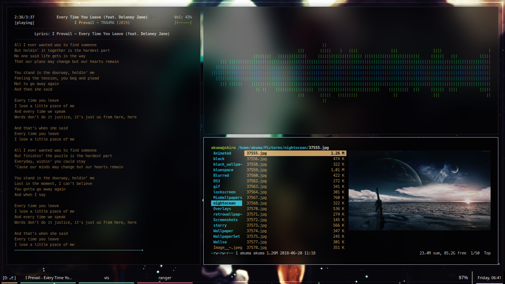
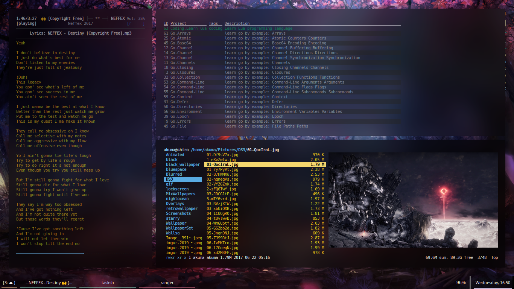
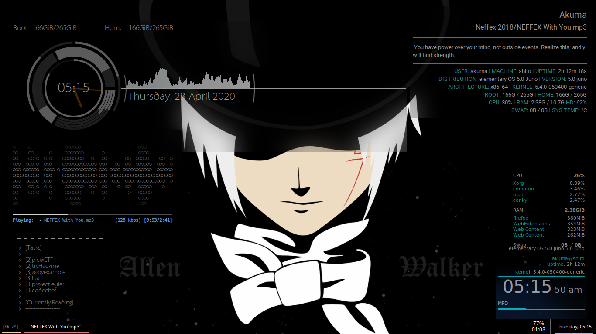
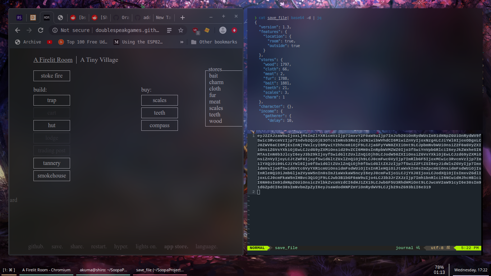
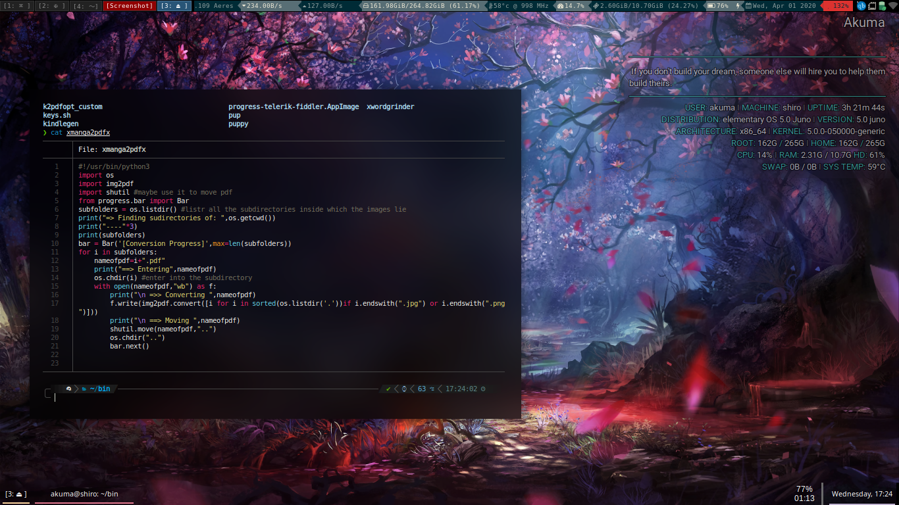

# My pewpew Configurations

Well, Its been quite some time  since I switched to linux. I had been delaying it for long but atlast it caught up with me kek. 

So here are the configs, they are from **various** sources, I shall try my Best to cite as many as I can, forgive and drop me a mail if I fail to do the same. 

You are from here on forth free to use it as you want, just dont expect ay warranty or anything. It works for me, if it doesn't I can try helping but again thats not my responsibility. 

These are from various sources, so many that I dont even remember those on top of my head. 

So without a further ado,

* **WM**: i3-gapps
* **TERMiNAL**: Termite, Alacritty and Tilix.
* **MUSIC**: mpd+ncmpcpp, cmus
* **VISUALISER**: vis, ncmpcpp's inbuilt visualiser
* **BARS**: Bumblebee (default solzarized), Tint2 (minima)
* **BROWSERS**: Chrmoium, Firefox, Min
* **EDITOR**: Neo-vim with Modifications 
* **FILE MANAGER**: Thunar
* **THEME**: Ant-Nebula
* **FONT**: Noto Sans
* **SHELL**: ZSH+Oh-my-zsh
* **ZSH THEME**: powerlevel10k
* **CAT Alternative**: bat
* **Compositor**: Compton+kawase blur fork

# Screenshots: 
### Nincolors+mpd+ncmpcpp

### ncmpcppLyrics+Taskwarrior+Ranger

### Conky + Neofetch 

### Chromium + jq + nvim

### Bumblebee status + Manga for kindle script

# TODO:

- [x]	Add conkies config
- [x] 	Add tint2 configs
- [x]   Add termite configs
- [ ]   Create installation script
- [ ]	Add mpd.conf, ncmpcpp config
- [ ]	Add .bashrc + .zshrc
- [ ]   Add custom scripts
- [ ]	pewpew :D 

# Shamefully stolen from: 
* Starter pack, base configs and built everything from scratch on this.
[Base Config](https://github.com/addy-dclxvi/i3-starterpack)

* Collection of Conkies and Tints really good.
[Conkies](https://github.com/addy-dclxvi/conky-theme-collections)
[Tint2](https://github.com/addy-dclxvi/tint2-theme-collections)

* Really Awesome Neovim configs
[Neovim](https://github.com/Optixal/neovim-init.vim)

